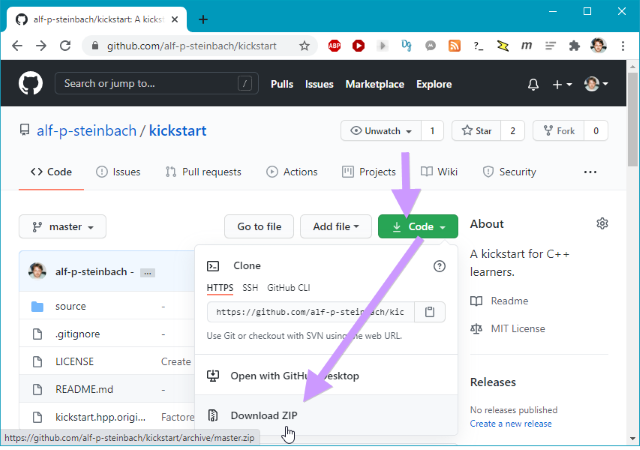

# “Hello, world!” – *installation & first use*.

To install the library,

1. Download it.
2. *Make it so* that the compiler will find the `<kickstart/all.hpp>` header.
3. Test it by compiling and running the Kickstart “Hello, world!” example.

## 1. Download.

A simple way to download is to **download** the library ZIP archive file from Github,

… and **unzip** that file. Windows File Explorer treats zip files much like folders, and “unzipping” then means copying the contents out to some real folder. In Windows’ right click menu for a ZIP file there is also a choice to “extract”, and that also means unzip.

 An alternative (still in Windows), and generally my preference, is to use the [7z](https://www.7-zip.org/) free tool.

 Instead of downloading a ZIP archive you can use git tools to clone the project “https://github.com/alf-p-steinbach/kickstart.git”.

## 2. Make the compiler find `<kickstart/all.hpp>`.

If you downloaded a ZIP and unzipped, then in the unzipped library the root of the header folder hierarchy is “kickstart-master/source/library”.

At least, that’s how it appeared to me when I tested downloading and unzipping just now.

I.e. there is a “kickstart-master/source/library/all.hpp” header, which is the one that you want the compiler to find as `<kickstart/all.hpp>`.

A simple way is to

* **copy** the “kickstart/source/library” folder from the unzipped archive, to a folder that your compiler searches for headers, and **rename** the folder copy from “library” to “kickstart”.

For example, in Ubuntu it worked nicely to place the new “kickstart” folder in
~~~pre
/usr/include
~~~

… (it just needed to be done using `sudo`);
 
in Windows for the MinGW g++ compiler you might have a folder such as my
 
~~~pre
H:\installed\mingw\nuwen\MinGW 9-2\include
~~~
  
… where you can place it; and in Windows for the Visual C++ compiler you might have a folder such as my
   
~~~pre
C:\Program Files (x86)\Microsoft Visual Studio\2019\Community\VC\Tools\MSVC\14.27.29110\include
~~~

Making the compiler find `<kickstart/all.hpp>` can also be done in more advanced ways. For example, in Windows I have a common “include” folder that I’ve configured both the MinGW g++ and Visual C++ compilers to search for headers, and in that common “include” folder I have a folder junction (a Windows thing sort of like a symbolic link) called “kickstart” that refers to my “kickstart-1/source/library” folder somewhere else on the disk. I use a junction out of old habit, and because unlike a symbolic link it can be created with the `mklink` command without setting up Windows developer mode or configuring user privileges.

## 3. Test: compile and run the Kickstart “Hello, world!” example.

Here’s a Kickstart “Hello, world!” program that should now compile:

[[*examples/hello-world.cpp*](hello-world.cpp)]:
~~~cpp
#include <kickstart/all.hpp>
using namespace kickstart::all;

auto main() -> int
{
    out << "Hello, world!" << endl;
}
~~~

Short explanations:

* For a simple program the `using namespace kickstart::all` directive has the convenience of a `using namespace std;` but mainly without name collision problems, i.e. it’s a much more safe thing.

* The `out` stream is an object that provides `<<` notation, that for output to the console supports UTF-8 encoding in a portable way, i.e. international text also in Windows consoles.

To compile you should specify at least C++17 and use of UTF-8 to the compiler, plus, for Visual C++, that it should support the standard `and`, `or` and `not` keywords. For g++ this just means using the option **`-std=c++17`**, because with g++ UTF-8 and the boolean keywords support is the default. For example, here using MinGW g++ in Windows:

~~~pre
[C:\my\dev\libraries\kickstart-1\source\examples]
> g++ -std=c++17 hello-world.cpp

[C:\my\dev\libraries\kickstart-1\source\examples]
> a
Hello, world!
~~~

---

If you don’t specify C++17 and the compiler defaults to an earlier C++ version, or if the compiler does not properly set the `__cplusplus` macro to indicate the C++ version, then as a beginner-friendly library Kickstart tells you and ensures that compilation stops:

~~~pre
[C:\my\dev\libraries\kickstart-1\source\examples]
> g++ hello-world.cpp
In file included from c:\my\dev\include/kickstart/all.hpp:3,
                 from hello-world.cpp:1:
c:\my\dev\include/kickstart/assertion-headers/assert-is-c++17-or-later.hpp:36:13: fatal error: C++17-or-later-is-required: No such file or directory
   36 | #   include <C++17-or-later-is-required>
      |             ^~~~~~~~~~~~~~~~~~~~~~~~~~~~
compilation terminated.
~~~

And ditto with Visual C++ (the compiler is invoked via command `cl`):

~~~pre
[C:\my\dev\libraries\kickstart-1\source\examples]
> cl /nologo hello-world.cpp
hello-world.cpp
c:\my\dev\include\kickstart\assertion-headers/assert-is-c++17-or-later.hpp(32): error C2338: Requires C++17 or later. For MSVC use e.g. `/std:c++17 /Zc:__cplusplus /FI"iso646.h" /wd4459 /utf-8`.
c:\my\dev\include\kickstart\assertion-headers/assert-is-c++17-or-later.hpp(36): fatal error C1083: Cannot open include file: 'C++17-or-later-is-required': No such file or directory
~~~

For Visual C++ the necessary options can just be copied and pasted from the error message, and then the compilation succeeds:

~~~pre
[C:\my\dev\libraries\kickstart-1\source\examples]
> cl /nologo /std:c++17 /Zc:__cplusplus /FI"iso646.h" /wd4459 /utf-8 hello-world.cpp /Feb
hello-world.cpp
c:\my\dev\include\kickstart\core\text_conversion/to-number.hpp(68): warning C4530: C++ exception handler used, but unwind semantics are not enabled. Specify /EHsc

[C:\my\dev\libraries\kickstart-1\source\examples]
> b
Hello, world!
~~~

---

For Visual C++ you can store common compiler options in the **CL** environment variable, and then they’re used automatically.

For g++ there is as far as I know no such general options environment variable, though there are some more specific environment variables, e.g. `CPATH` for include folder paths. However, it's possible to configure the compiler via a ***specs* file**, which (undocumented) must have Unix line endings. You can generate a copy of the *specs* file currently in use, via option `-dumpspecs`.

Still, though at one time I did force myself to generate a g++ *specs* file with every new installation of that compiler, I now prefer to just use a script wrapper (in Windows a batch file) and/or a command interpreter alias, or an explicitly used environment variable.
