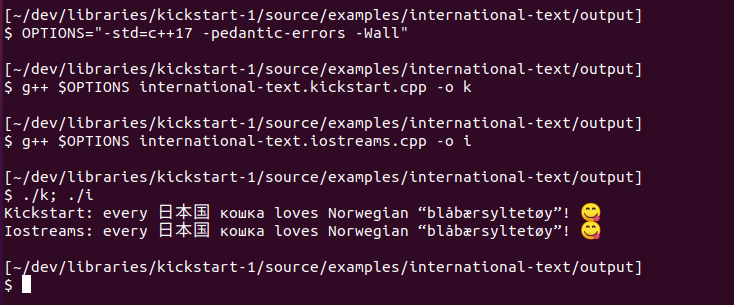

# Display international text in a console window.

Displaying international text in a portable manner is easy with Kickstart:

[*examples/international-text/output/international-text.kickstart.cpp*]:
~~~cpp
// Source encoding: utf-8  --  π is (or should be) a lowercase Greek pi.
#include <kickstart/core.hpp>
using namespace kickstart::core;

auto main() -> int
{
    output( "Kickstart: every 日本国 кошка loves Norwegian “blåbærsyltetøy”! 😋\n" );
}
~~~

To the best of my knowledge “日本国 кошка” means “Japanese cat”, with “Japanese” written in Chinese and “cat” written in Russian. “Blåbærsyltetøy” is Norwegian for blueberry jam. Thus the text says, in a mixture of languages, that every Japanese cat loves Norwegian blueberry jam.

This text is problematic in a Windows console because

* per 2020, in most of the world a directly standard-library based C++ Windows program will by default present UTF-8 encoded Russian “кошка” as gibberish “ð║ð¥Ðêð║ð░”;

* Windows consoles do not choose alternate fonts for symbols not found in the single selected font (i.e. they don’t do intelligent font substitution), so while Kickstart ensures that “日本国” is correctly stored in the window’s text buffer, even with Kickstart output it’s still ***presented*** as just rectangles, “▯▯▯”; and

* by the design of the API Windows consoles are by default limited to the Basic Multilingual Plane—the BMP—of Unicode, corresponding to original 16-bit Unicode, and since that part doesn’t include modern emoticons even with Kickstart output (the library can unfortunately not do magic) the “😋” emoticon is displayed as something else, e.g. as a single rectangle “▯”.

So, in Windows Kickstart output transmits the program’s text properly to the console window, unlike current standard library implementations as of 2020. The most common non-ASCII text, such as Cyrillic “кошка”, therefore displays properly, or at least recognizably except for uppercase/lowercase, and some more rare non-ASCII text such as Chinese “日本国” is stored correctly in the window’s text buffer, where you can copy it out correctly. Most modern emoticons are however messed up beyond recognition, since they just don’t exist in a Windows console window’s symbol repertoire.

## Results.
Linux, here in Ubuntu:

Ubuntu in a Windows WSL (the Windows Subsystem for Linux) console:

## asd.

