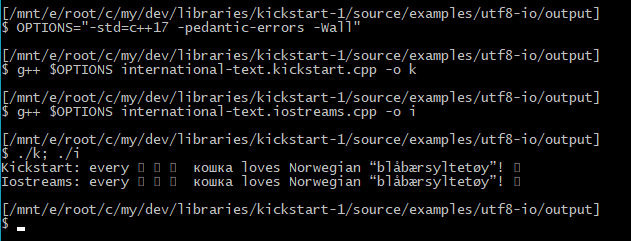
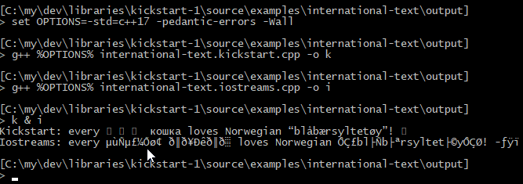

# Display international text in a console window.

Displaying international text in a portable manner is easy with Kickstart:

[[*examples/utf8-io/output/international-text.kickstart.cpp*](international-text.kickstart.cpp)]:
~~~cpp
// Source encoding: utf-8  --  π is (or should be) a lowercase Greek pi.
#include <kickstart/core.hpp>
using namespace kickstart::core;

auto main() -> int
{
    output( "Kickstart: every 日本国 кошка loves Norwegian “blåbærsyltetøy”! 😋\n" );
}
~~~

To the best of my knowledge “日本国 кошка” means “Japanese cat”, with “Japanese” written in Chinese and “cat” written in Russian. “Blåbærsyltetøy” is Norwegian for blueberry jam. Thus the text says in a mixture of languages, that every Japanese cat loves Norwegian blueberry jam.

This text is problematic in a Windows console because

* per 2020, in most of the world a directly standard-library based C++ Windows program will by default present UTF-8 encoded Russian “кошка” as gibberish like “ð║ð¥Ðêð║ð░”;

* Windows consoles do not choose alternate fonts for symbols not found in the single selected font (i.e. they don’t do intelligent font substitution), so while Kickstart ensures that “日本国” is correctly stored in the window’s text buffer, even with Kickstart output it’s still ***presented*** as just rectangles, “▯▯▯”; and

* by the design of the API Windows consoles are by default limited to the Basic Multilingual Plane—the BMP—of Unicode, corresponding to original 16-bit Unicode, and since that part doesn’t include modern emoticons even with Kickstart output the “😋” emoticon is displayed as something else, e.g. as a single rectangle “▯”.

In Windows Kickstart output transmits the program’s text properly to the console window, unlike current standard library implementations as of 2020. The most common non-ASCII text, such as Cyrillic “кошка” and Norwegian “blåbærsyltetøy”, therefore displays properly, or at least recognizably except for uppercase/lowercase, and some more rare non-ASCII text such as Chinese “日本国” is stored correctly in the window’s text buffer, where you can copy it out correctly. Most modern emoticons are however messed up beyond recognition, since they just don’t exist in a Windows console window’s symbol repertoire.

## Results.

Linux, here in Ubuntu:

It’s all perfectly presented, both with Kickstart i/o and with iostreams i/o.

---

Ubuntu in a Windows WSL (the *Windows Subsystem for Linux*) console:

Since it’s a Linux environment the UTF-8 encoded text is correctly transferred to the console, both with Kickstart i/o and with iostreams i/o.

But the Chinese glyhps are not rendered correctly, because the WSL console window is an ordinary Windows console window here used with a font that doesn’t have Chinese glyphs. Presumably in China a font is used that *can* display these glyphs. However, the emoticon problem is more fundamental, namely that with UTF-16 encoding the emoticon is represented with two 16-bit values called a “surrogate pair”, while the original design of Windows console windows only has room for one 16-bit value per symbol.

---

Windows Cmd:

The ordinary Windows console program builds reproduce the Chinese glyph and emoticon problems, since those problems are caused by the console itself. But here in addition, with my default Windows configuration the iostreams i/o fails to transfer the text correctly to the console. The result is just garbled gobbledygook.

## Manual configuration to make also iostreams output work.

A practical solution to the garbled iostreams output is to instead use Kickstart or another such library.

However, you can configure a Windows console to accept UTF-8 *output*. Beware, though, that that doesn’t fix UTF-8 *input*. So it’s a very limited solution, but still worth knowing about.

A Windows **codepage** is a number that identifies an encoding. A console window’s assumption about the encoding of a program’s output is called the console’s **active codepage**. One way to check the active codepage is via the `chcp` (short for “change codepage”) command:

~~~txt
[C:\my\dev\libraries\kickstart-1\source\examples\utf8-io\output]
> chcp
Active code page: 850

[C:\my\dev\libraries\kickstart-1\source\examples\utf8-io\output]
> _
~~~

Codepage 850 is a Western European adaption of the original IBM PC character set, codepage 437. The UTF-8 encoding is codepage **65001**. One way to set the codepage is via the same `chcp` command, just supplied with the number:

~~~txt
[C:\my\dev\libraries\kickstart-1\source\examples\utf8-io\output]
> chcp 65001 & i
Active code page: 65001
Iostreams: every ▯ ▯ ▯  кошка loves Norwegian “blåbærsyltetøy”! ▯

[C:\my\dev\libraries\kickstart-1\source\examples\utf8-io\output]
> _
~~~

## Programmatic configuration to make also iostreams output work.

To do the codepage configuration properly from within the program, so that the user doesn’t see and doesn’t have to deal with it, one would ideally use the Windows API. Here instead I show how you *can* just automate commands like those above, by using the `system` function. The separately compiled source below that does this, relies on an assumption that in Windows the `system` function executes a Cmd (Microsoft: “Command Prompt”) command.

[[*examples/utf8-io/output/windows-utf8-console.cpp*](windows-utf8-console.cpp)]:
~~~cpp
#ifndef _WIN32
#   error "This file is for Windows systems only."
#endif

#include <stdlib.h>     // system
#include <string>       // std::(to_string, string)

namespace {
    using namespace std::string_literals;
    using   std::string, std::to_string;

    auto cmd( const string& s )
        -> int
    { return ::system( s.c_str() ); }

    void set_codepage( const int id )
    {
        cmd( ""s + "chcp " + to_string( id ) + " >nul" );
    }

    auto get_codepage()
        -> int
    { return cmd( "for /f \"tokens=4\" %t in ('chcp') do @exit %t" ); }

    struct Console_codepage_fix
    {
        int original_codepage;

        ~Console_codepage_fix() { set_codepage( original_codepage ); }
        
        Console_codepage_fix():
            original_codepage( get_codepage() )
        {
            set_codepage( 65001 );
        }
    };
    
    const Console_codepage_fix the_fix = {};
}  // namespace <anon>
~~~

Adding this support to the iostreams output program:

~~~txt
[C:\my\dev\libraries\kickstart-1\source\examples\utf8-io\output]
> del *.exe

[C:\my\dev\libraries\kickstart-1\source\examples\utf8-io\output]
> g++ %options% international-text.iostreams.cpp windows-utf8-console.cpp -o i

[C:\my\dev\libraries\kickstart-1\source\examples\utf8-io\output]
> chcp 850
Active code page: 850

[C:\my\dev\libraries\kickstart-1\source\examples\utf8-io\output]
> i
Iostreams: every ▯ ▯ ▯  кошка loves Norwegian “blåbærsyltetøy”! ▯

[C:\my\dev\libraries\kickstart-1\source\examples\utf8-io\output]
> chcp
Active code page: 850

[C:\my\dev\libraries\kickstart-1\source\examples\utf8-io\output]
> _
~~~

Voilà! 😊

But it's simpler to just use the Kickstart library or another such library, and that also supports UTF-8 *input*.
